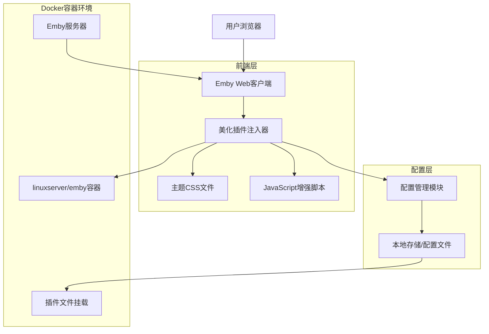
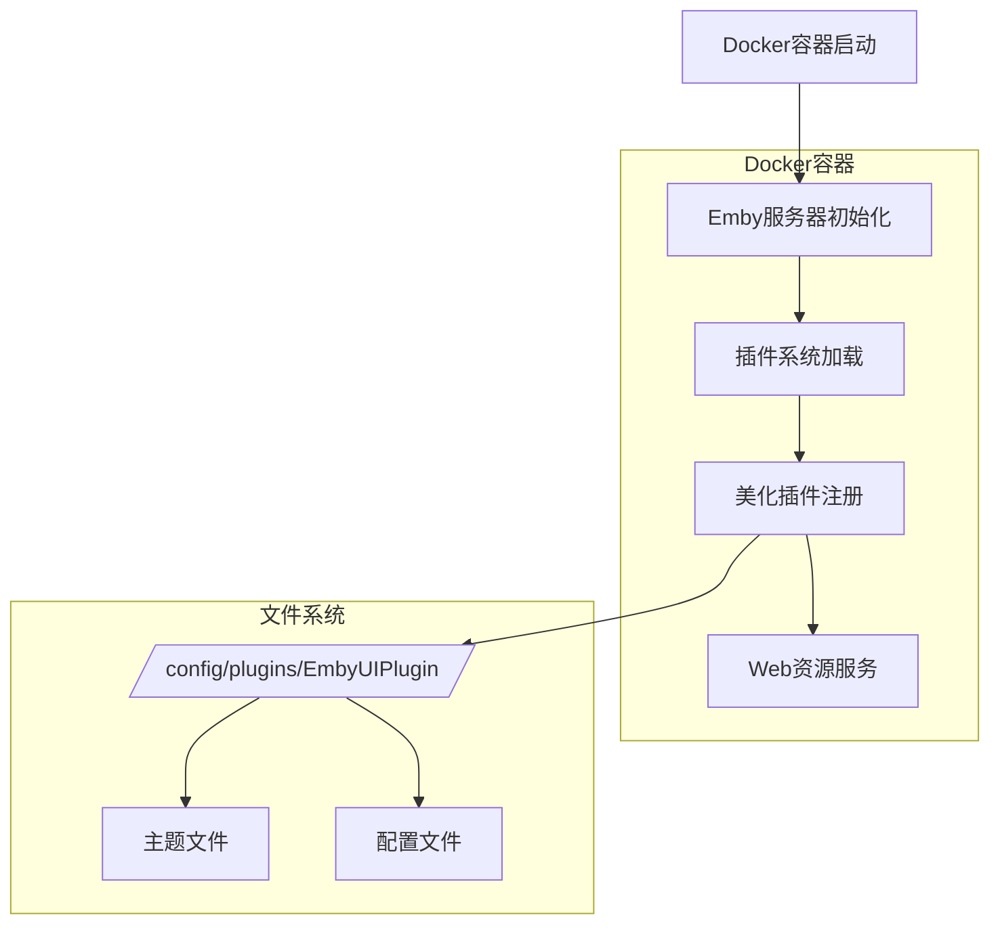
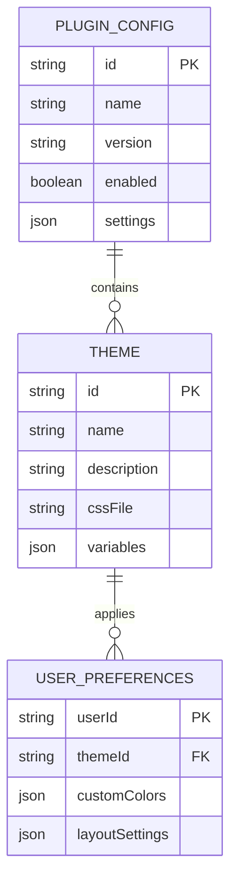

# Emby美化插件技术架构文档

## 1. 架构设计



## 2. 技术描述

- 前端：纯CSS + Vanilla JavaScript + HTML
- 部署：Docker容器文件挂载
- 存储：本地JSON配置文件
- 注入方式：Emby插件系统 + 用户脚本注入

## 3. 路由定义

| 路由 | 用途 |
|------|------|
| /web/index.html | Emby主页面，插件自动注入美化样式 |
| /web/configurationpage?name=EmbyUIPlugin | 插件配置页面，管理主题和设置 |
| /web/themes/ | 主题资源目录，存放CSS和图片文件 |
| /web/scripts/emby-ui-enhancer.js | 插件主脚本，负责样式注入和功能增强 |

## 4. API定义

### 4.1 核心API

插件配置管理
```
GET /emby/Plugins/EmbyUIPlugin/Configuration
```

请求参数：无

响应：
| 参数名称 | 参数类型 | 描述 |
|----------|----------|------|
| currentTheme | string | 当前使用的主题名称 |
| customColors | object | 自定义颜色配置 |
| layoutSettings | object | 布局设置参数 |
| isEnabled | boolean | 插件启用状态 |

示例响应：
```json
{
  "currentTheme": "dark-modern",
  "customColors": {
    "primary": "#1e3a8a",
    "secondary": "#7c3aed"
  },
  "layoutSettings": {
    "cardSpacing": 16,
    "borderRadius": 8
  },
  "isEnabled": true
}
```

主题应用
```
POST /emby/Plugins/EmbyUIPlugin/ApplyTheme
```

请求：
| 参数名称 | 参数类型 | 是否必需 | 描述 |
|----------|----------|----------|------|
| themeName | string | true | 要应用的主题名称 |
| customSettings | object | false | 自定义设置覆盖 |

响应：
| 参数名称 | 参数类型 | 描述 |
|----------|----------|------|
| success | boolean | 应用是否成功 |
| message | string | 操作结果消息 |

## 5. 服务器架构图



## 6. 数据模型

### 6.1 数据模型定义



### 6.2 数据定义语言

插件配置文件 (plugin-config.json)
```json
{
  "id": "emby-ui-plugin",
  "name": "Emby UI美化插件",
  "version": "1.0.0",
  "enabled": true,
  "settings": {
    "defaultTheme": "dark-modern",
    "allowUserCustomization": true,
    "autoUpdate": false
  }
}
```

主题定义文件 (theme-config.json)
```json
{
  "themes": [
    {
      "id": "dark-modern",
      "name": "深色现代",
      "description": "现代化的深色主题，适合夜间使用",
      "cssFile": "themes/dark-modern.css",
      "variables": {
        "--primary-color": "#1e3a8a",
        "--secondary-color": "#7c3aed",
        "--background-color": "#0f172a",
        "--text-color": "#f8fafc"
      }
    },
    {
      "id": "light-elegant",
      "name": "浅色优雅",
      "description": "优雅的浅色主题，适合日间使用",
      "cssFile": "themes/light-elegant.css",
      "variables": {
        "--primary-color": "#3b82f6",
        "--secondary-color": "#8b5cf6",
        "--background-color": "#ffffff",
        "--text-color": "#1f2937"
      }
    }
  ]
}
```

用户偏好设置 (user-preferences.json)
```json
{
  "userId": "user123",
  "themeId": "dark-modern",
  "customColors": {
    "primary": "#1e40af",
    "accent": "#8b5cf6"
  },
  "layoutSettings": {
    "cardSpacing": 20,
    "borderRadius": 12,
    "animationSpeed": "normal"
  },
  "lastModified": "2024-01-15T10:30:00Z"
}
```

Docker挂载配置示例：
```yaml
version: '3.8'
services:
  emby:
    image: linuxserver/emby:latest
    volumes:
      - ./config:/config
      - ./emby-ui-plugin:/config/plugins/EmbyUIPlugin
      - ./media:/data
    environment:
      - PUID=1000
      - PGID=1000
    ports:
      - "8096:8096"
```