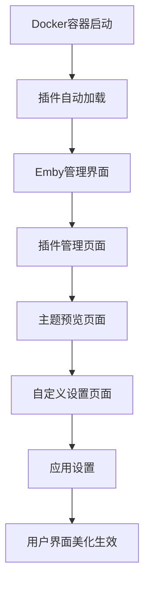

# Emby服务器美化插件产品需求文档

## 1. 产品概述

Emby UI美化插件是一个专为Emby媒体服务器设计的界面增强工具，通过自定义CSS样式和JavaScript脚本来美化Emby的Web界面。

该插件主要解决Emby默认界面单调、缺乏个性化定制选项的问题，为用户提供更加美观、现代化的媒体浏览体验。

目标是成为linuxserver/emby Docker容器的标准美化解决方案，提升用户的媒体管理体验。

## 2. 核心功能

### 2.1 用户角色

| 角色 | 注册方式 | 核心权限 |
|------|----------|----------|
| Emby管理员 | Emby服务器管理员账户 | 可以安装、配置和管理美化插件 |
| Emby用户 | 普通Emby用户账户 | 可以使用美化后的界面，查看个人设置 |

### 2.2 功能模块

我们的Emby美化插件包含以下主要页面：
1. **插件管理页面**：插件安装、主题选择、配置管理。
2. **主题预览页面**：主题效果预览、实时切换。
3. **自定义设置页面**：颜色配置、布局调整、个性化选项。
4. **帮助文档页面**：安装指南、使用说明、故障排除。

### 2.3 页面详情

| 页面名称 | 模块名称 | 功能描述 |
|----------|----------|----------|
| 插件管理页面 | 主题库 | 浏览和选择预设主题，支持主题预览和一键应用 |
| 插件管理页面 | 插件状态 | 显示插件运行状态，支持启用/禁用功能 |
| 主题预览页面 | 实时预览 | 实时显示主题效果，支持不同设备尺寸预览 |
| 主题预览页面 | 主题切换 | 快速切换不同主题，支持撤销操作 |
| 自定义设置页面 | 颜色配置 | 自定义主色调、背景色、文字颜色等 |
| 自定义设置页面 | 布局设置 | 调整卡片大小、间距、排列方式 |
| 自定义设置页面 | 动画效果 | 配置过渡动画、悬停效果、加载动画 |
| 帮助文档页面 | 安装指南 | 详细的Docker容器集成步骤 |
| 帮助文档页面 | 使用教程 | 功能使用说明和最佳实践 |

## 3. 核心流程

**管理员流程：**
管理员首先通过Docker容器挂载或复制的方式安装插件文件，然后在Emby管理界面中启用插件，接着可以在插件管理页面选择和配置主题，最后应用设置使所有用户生效。

**普通用户流程：**
普通用户登录Emby后自动看到美化后的界面，可以在个人设置中调整部分个性化选项，如颜色偏好和布局密度。

## 4. 用户界面设计

### 4.1 设计风格

- **主色调**：深蓝色(#1e3a8a)和紫色(#7c3aed)渐变
- **辅助色**：灰色(#6b7280)和白色(#ffffff)
- **按钮样式**：圆角按钮，支持悬停渐变效果
- **字体**：Roboto, 'Noto Sans SC', sans-serif，主要字号14px-16px
- **布局风格**：卡片式设计，顶部导航栏，响应式网格布局
- **图标风格**：Material Design图标，简洁现代

### 4.2 页面设计概览

| 页面名称 | 模块名称 | UI元素 |
|----------|----------|--------|
| 插件管理页面 | 主题库 | 网格布局的主题卡片，每个卡片包含预览图、名称、描述和应用按钮 |
| 插件管理页面 | 插件状态 | 状态指示器、开关按钮、版本信息显示 |
| 主题预览页面 | 实时预览 | 大尺寸预览窗口，支持桌面/平板/手机视图切换 |
| 自定义设置页面 | 颜色配置 | 颜色选择器、实时预览、重置按钮 |
| 自定义设置页面 | 布局设置 | 滑块控件、数值输入框、预设选项 |

### 4.3 响应式设计

采用移动优先的响应式设计，支持桌面端(1200px+)、平板端(768px-1199px)和移动端(767px以下)的适配，确保在不同设备上都有良好的用户体验。